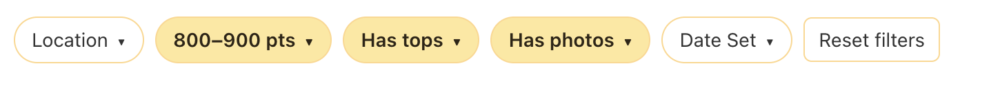
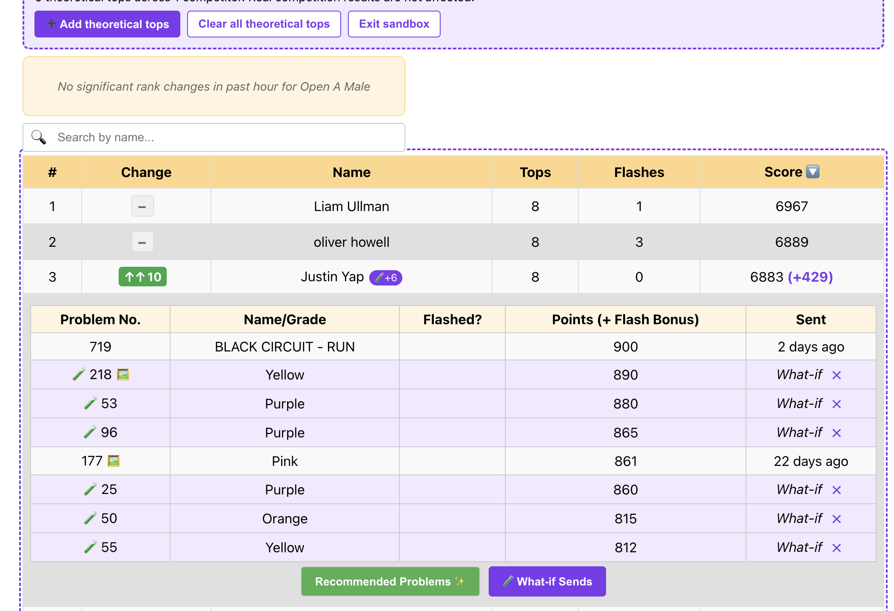

# FingerComps+

**FingerComps+** is a fan-made web application that lets climbing competitors see each others scores more deeply. The site is live at: [https://fingercomps.plus](https://fingercomps.plus)

I built this app to complement the amazing [FingerComps](https://fingercomps.com/) product and enable learning and growth for all fellow competition climbers.

This repository is a fork of [latiosu/fingercomps-extended](https://github.com/latiosu/fingercomps-extended) that adds:

- Filtering pills for narrowing competitor results by location, score range, tops, photos, and set date.
- A what-if sandbox for adding theoretical tops and previewing score or rank changes without affecting real competition results.

**Filtering pills**



**What-if sandbox**



**Features**
- See recommended pumpfest problems per user
- See problem statistics for a competition
- See scores of other competitors
- View finals scoreboard for a competition at `/finals?compId=<your_comp_id>&allowedUsers=<comma_separated_user_ids>&category=<category_code>`
- Initial order of finalists is allowedUsers order

## Installation

To set up this project locally, follow these steps:

1. **Install dependencies:**

    ```bash
    npm install
    ```

2. **Start the development server:**

    ```bash
    npm start
    ```

This will start the app on http://localhost:3000.

## Deployment

This site is automatically deployed to GitHub Pages. To manually trigger a deployment:

```bash
npm run deploy
```

The deploy script uses the `gh-pages` package to publish the contents of the build directory to the `gh-pages` branch.

## License

This project is licensed under the [MIT License](https://github.com/latiosu/fingercomps-extended/blob/main/LICENSE). You are free to use, modify, and distribute this project with attribution.
